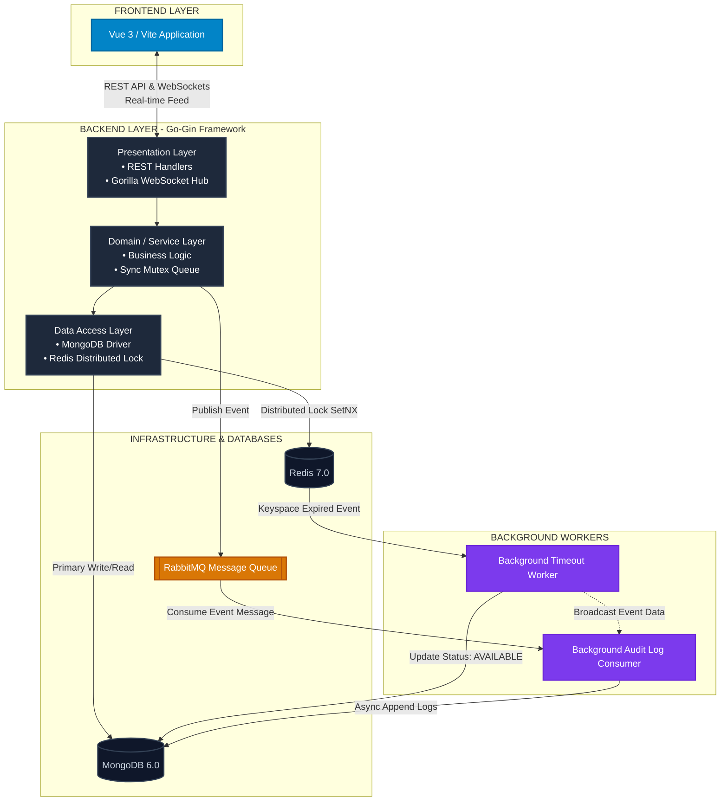

# 🎬 Cinema Ticket Booking System

ระบบจำลองการจองตั๋วภาพยนตร์ พัฒนาบนสถาปัตยกรรมแยกส่วนหลังบ้านและหน้าบ้าน (**Decoupled Full-Stack Architecture**) มีระบบจัดการ Concurrency ป้องกันปัญหา Double Booking พร้อมระบบเก็บประวัติกิจกรรมผู้ใช้ (Audit Logs) และหน้าจอแอดมินสำหรับการตรวจสอบ Logs

---

## 📊 1. System Architecture Diagram

ระบบนี้ออกแบบตามหลัก **Domain-Driven Layered Architecture (DDD Lite)** และยึดหลัก **Single Responsibility Principle (SRP)** เพื่อให้โค้ดแยกส่วนจากกันอย่างชัดเจน:

```text
[ FRONTEND LAYER (Vue 3) ]
        │  ▲
        │  │ (REST API / WebSockets Real-time Feed)
        ▼  │
[ BACKEND LAYER (Go-Gin Framework) ]
   ├── Presentation Layer  --> (REST Handlers & Gorilla WebSocket Hub)
   ├── Domain(Service) Layer --> (Business Logic, Sync Mutex Queue)
   └── Data Access Layer    --> (MongoDB Driver & Redis Distributed Lock)
        │         │
        ▼         ▼
  [ MongoDB ] [ Redis ] ──(Expired Event Key)──> [ Background Timeout Worker ]
        ▲                                                      │
        └───────────────────(Update AVAILABLE)─────────────────┘
                                       ▲
                                 (Async Append)
                                       │
 [ RabbitMQ Message Queue ] ──> [ Background Audit Log Consumer ]
```

---

## 🛠️ 2. Tech Stack Overview

### Frontend
*   **Core Framework:** Vue 3
*   **Build Tool & Dev Server:** Vite (Docker Container)
*   **State Management:** Pinia Store (ระบบคลังจัดเก็บ Session ข้อมูล Token และสิทธิ์ที่ตอบกลับมาจากหลังบ้าน)
*   **Routing & Guards:** Vue Router 4 (ระบบ Navigation Guard)
*   **API Network Client:** Axios (ตั้งค่า Request Interceptor เพื่อแนบ Bearer Identity Token ไปหาหลังบ้าน)
*   **Authentication UX:** Vue3 Google Sign-In (ปุ่มดึงหน้าต่าง Pop-up ยืนยันตัวตนสำเร็จรูปตามมาตรฐาน OAuth 2.0)

### Backend
*   **Language & Runtime:** Go (Golang)
*   **HTTP REST Framework:** Gin Gonic
*   **Real-time Protocol:** Gorilla WebSocket Server สำหรับทำท่อสัญญาณ Broadcast updata สถานะที่นั่งแบบเรียลไทม์
*   **Database Drivers:** Official Mongo Go Driver, Go-Redis v9, AMQP091 (RabbitMQ Client)

### Infrastructure
*   **MongoDB:** ฐานข้อมูลหลัก (Primary DB) เก็บข้อมูลผังที่นั่ง
*   **Redis:** เก็บข้อมูลในหน่วยความจำ คุม **Distributed Lock** และใช้ฟีเจอร์ **Keyspace Notifications (`Ex`)** ดักฟังสัญญาณคีย์หมดอายุ
*   **RabbitMQ:** ระบบ Message Queue จัดคิวส่งประวัติกิจกรรมสำคัญแบบ **Asynchronous Logging** เพื่อลดภาระงานบนเธรดหลัก (Main Thread)

---

## 🔄 3. Booking Flow Step by Step

### Step 1: ยืนยันรับสิทธิ์ตัวบุคคล (`http://localhost:3000/login`)
ผู้ใช้งานกดปุ่ม Google Sign-In ผ่าน Pop-up หน้าบ้าน ➡️ เมื่อสำเร็จ หน้าบ้านจะส่ง Token (JWT) ข้ามมาให้หลังบ้าน Go ตรวจสอบ ➡️ หลังบ้านทำการตรวจสอบกับ Google Server แกะรหัสสกัดเอาค่า `user_id (sub)` และอีเมลตัวจริงมาฝังเข้า Context ➡️ หลังบ้านส่ง (`role`) กลับไปให้หน้าบ้าน และหน้าบ้านพาไปที่หน้าผังที่นั่ง (`http://localhost:3000/seats`)

### Step 2: เลือกจองที่นั่ง (`http://localhost:3000/seats`)
หน้าบ้านดึงตารางผังเก้าอี้ 2 แถว แถวละ 5 ตัว (A1-B5) มาจาก MongoDB แสดงคู่สีเรียลไทม์: **AVAILABLE (สีแดง)**, **LOCKED (สีส้ม)**, และ **BOOKED (สีเทา)** ➡️ ผู้ใช้คลิกเก้าอี้ตัวที่ว่าง (ปุ่มเปลี่ยนสถานะเป็น **Local SELECTED - สีฟ้า** มีผลเฉพาะเครื่องเรา) ➡️ เมื่อพอใจแล้ว กดปุ่ม `Next` เพื่อส่งรายการขอล็อกเก้าอี้ขึ้นไปหาเซิร์ฟเวอร์

### Step 3: ล็อกที่นั่งและนับเวลาถอยหลัง (`http://localhost:3000/confirm`)
หลังบ้านรับคำขอแล้วสั่งวิ่งไปทำกระบวนการ **Atomic Multi-Lock** บน Redis 
*   **กรณีล็อกสำเร็จ:** หลังบ้านจะสั่งเปลี่ยนสเตตัสใน MongoDB เป็น `LOCKED` (สีส้ม) ส่งข้อความกระจายผ่าน WebSocket เปลี่ยนผังเก้าอี้(ที่เลือก)บนจอของทุกคนเป็นสีส้ม ➡️ หน้าจอผู้ใช้จะเข้าสู่หน้ายืนยันรายการ (`/confirm`) และเริ่มนาฬิกานับเวลาถอยหลัง อ้างอิงตามค่า Timestamp `locked_until` ที่ระบบส่งมา หากปิดหน้าจอหรือกดกดย้อนกลับ ระบบ Persistence บนเครื่องจะจดจำข้อมูลสิทธิ์ใน LocalStorage ให้กลับมาจ่ายตังค์ต่อได้จนกว่าจะหมดเวลาจริง
*   **กรณีล็อกไม่สำเร็จ (โดนคนอื่นแย่งตัดหน้าจองเก้าอี้ตัวใดตัวหนึ่งไปก่อนในเสี้ยววินาทีเดียวกัน):** หลังบ้านจะสั่ง **Reject ปฏิเสธทั้งคำขอทันที (All-or-Nothing)** และปล่อยเก้าอี้ตัวที่เหลือว่าง เพื่อป้องกันปัญหาระบบทำงานไม่สมบูรณ์

### Step 4: สิ้นสุดธุรกรรม (`http://localhost:3000/confirm`)
*   **ผู้ใช้กด Confirm:** ระบบจะสั่งอัปเดต MongoDB เป็นสถานะ `BOOKED` (สีเทาถาวร) เคลียร์คีย์ใน Redis และกระจายสัญญาณ WebSocket เปลี่ยนจอของทุกคนในระบบเป็นสีเทาทันทีโดยไม่ต้องกดรีโหลดหน้าจอ
*   **ผู้ใช้กด Cancel หรือ ปล่อยไว้จนหมดเวลา 5 นาที (Timeout):** ตัวดักจับเวลาเบื้องหลัง (Redis Timeout Listener) หรือสคริปต์ยกเลิก จะทำการตรวจสอบสิทธิ์ความเป็นเจ้าของที่นั่งอย่างปลอดภัย และดีดสถานะเก้าอี้ชุดนั้นกลับคืนไปเป็น **AVAILABLE (สีแดงว่าง)** และกระจายแจ้งข่าวบอกหน้าบ้านทุกคนในวินาทีเดียวกัน

---

## 🔐 4. Redis Lock Strategy & Concurrency Prevention

เพื่อป้องกันปัญหา Double Booking จึงเลือกใช้กลยุทธ์ **Atomic Multi-Seat Distributed Lock** :

1.  **Pipeline Multi-Lock:** ตอนทำรายการจองที่นั่งพร้อมกันหลายตัว ระบบจะส่งชุดคำสั่ง `SETNX` (Set if Not Exists) รวดเดียวผ่านระบบ Redis Pipeline เพื่อป้องกันอาการหน่วง
2.  **All-or-Nothing Rollback:** หากมีเก้าอี้แม้แต่ตัวเดียวในเซ็ตเกิดติดล็อกอยู่ (SetNX คืนค่าเป็น false) ตัวแอปหลังบ้าน Go จะสั่งยกเลิกงานและทำลายคีย์ตัวที่แอบสร้างไว้ในรอบนั้นคืนคลังทันที ป้องกันผังเก้าอี้ผีหลุดค้างในระบบ
3.  **Lua Script Safe Release:** ตอนที่คำสั่งสั่งยกเลิกตั๋ว (Cancel) หรือปล่อยหลุดจองเนื่องจากหมดเวลา 5 นาทีวิ่งเข้ามา การสั่งทำลายคีย์ใน Redis จะรันผ่าน **Lua Script** ซึ่งทำงานเป็นเนื้อเดียวกัน (Atomic Operation) สคริปต์จะตรวจสอบข้อมูลข้างในก่อนว่า Value ยังคงเป็นรหัส `user_id` ของผู้ใช้คนนี้จริงหรือไม่ วิธีนี้ช่วยการันตีว่าคำสั่งลบล็อกที่มาช้า จะไม่มีวันกระโดดไปลบคีย์ล็อกอันใหม่ของผู้ใช้งานคนถัดไป เพื่อป้องกันปัญหา Race Condition

---

## 📣 5. การทำงานของ Message Queue (RabbitMQ Use Case)

ระบบนี้ได้แยกท่อการส่งข้อมูลออกจากขารับ เพื่อป้องกันปัญหาท่อแย่งข้อมูลชนกัน (**Channel Isolation Strategy**) โดยมี Use Case การนำไปใช้งานจริงดังนี้:

1.  **Asynchronous Logging & Audit Trail:** ทุกครั้งที่เกิดเหตุการณ์สำคัญในระบบ เช่น `SEATS_LOCKED`, `BOOKING_SUCCESS`, `BOOKING_TIMEOUT`, `SYSTEM_RESET_BY_ADMIN` หรือเกิดเหตุการณ์แย่งตั๋วชนกันอย่าง **`SYSTEM_LOCK_FAIL`** ตัวแอปหลัก Go จะทำการแปลงข้อมูลเป็น JSON แล้วโยนเข้าคิว `booking_events` ของ RabbitMQ ทันทีโดยไม่บล็อกเวลาใช้งานหลัก ➡️ จากนั้นตัว Background Task ชื่อ `RabbitConsumer` จะค่อยๆ ส่งข้อความมาเขียนบันทึกลง MongoDB คอลเลกชัน `audit_logs` เพื่อทำประวัติให้แอดมินเข้าไปตรวจสอบข้อผิดพลาดได้ย้อนหลัง
2.  **Real-time WebSocket Broadcast Feed:** ตัว `RabbitConsumer` เมื่อดึงข้อมูลกิจกรรมออกมาได้สำเร็จ จะทำหน้าที่ส่งสารกระจายต่อไปให้ระบบ `seat.Hub` สั่งพ่นข้อมูลไปที่ WebSocket เปลี่ยนสีปุ่มเก้าอี้และแสดงข้อความหมายเหตุรายละเอียดความผิดพลาด (**`error_msg`**) ขึ้นหน้าจอแดชบอร์ดแอดมินและผังเก้าอี้ของผู้ใช้ทุกคนในแบบเรียลไทม์

---

## 🏃‍♂️ 6. วิธีรันระบบ (How to Run)

option 1: เปิด terminal ที่ path ../cinema-ticket-booking-system แล้วสั่ง **docker-compose up --build**
option 2(สำหรับ windows): double-click **start-app.bat**

Option 1:
```bash
# 1. เข้าไปที่โฟลเดอร์นอกสุดของโปรเจกต์ (จุดที่มีไฟล์ docker-compose.yml)
# 2. พิมพ์คำสั่งสั่งคอมไพล์และเปิดระบบ:
docker compose up --build
```
Option 2:
```bat file
double-click start-app.bat
```

*   **User/Admin View:** เปิดเบราว์เซอร์ไปที่ `http://localhost:3000` (ระบบจะเด้งไปหน้า `/login`)

---

## 🧪 7. คู่มือการทดสอบระบบผ่านโปรแกรม Postman (Postman Collection Testing)

คุณสามารถทดสอบยิง API ผ่าน Postman ด้วยขั้นตอนดังนี้:

### Import Collection
1. เปิดโปรแกรม Postman ขึ้นมา คลิกที่ปุ่ม **`Import`** บริเวณมุมซ้ายบน
2. ลากไฟล์ json ชื่อ **`Cinema-Ticket-Booking-System.postman_collection.json`** วางใส่หน้าต่างเพื่อนำเข้าโฟลเดอร์ API ทั้งหมดมาใช้งาน

### วิธี Bypass Token
เพื่ออำนวยความสะดวกในการทดสอบระบบ ให้ตั้งค่าช่องสิทธิ์ (Authorization) ดังนี้:
1. คลิกเลือก Request API ที่ต้องการทดสอบ ➡️ ไปที่แถบ **Authorization** ➡️ เลือกประเภทเป็น **`Bearer Token`**
2. **หากต้องการเป็นผู้ใช้ทั่วไป (USER):** ในช่องกรอกข้อความ Token ให้พิมพ์คำว่า:
   ```text
   mock-user-customer@gmail.com
   ```
3. **หากต้องการเป็นผู้ดูแลระบบ (ADMIN):** ในช่อง Token บน Postman ให้พิมพ์คำว่า:
   ```text
   mock-user-admin@gmail.com
   ```
   ปล. หากต้องการเพิ่ม admin gmail เพื่อใช้งาน admin ที่หน้า web ให้เปิดไฟล์นอกสุด **`.env`** นำอีเมลแอดมินของคุณไปเพิ่มระบุไว้ในฟิลด์คีย์ `ADMIN_EMAILS=`

### ⚡ วิธีการทดสอบ Concurrency แย่งจองที่นั่งตัวเดียวกันพร้อมกันหลายคน
1. คลิกเลือก Request ชื่อ **`Test concurrency reserve`**
2. ตั้งค่าแถบ Authorization เลือกเป็น Bearer Token และใส่:
   ```text
   mock-user-{{$randomInt}}@gmail.com
   ```
3. แถบ **Body (JSON)** ระบุตั้งค่ารหัสที่นั่งเบอร์เดียวกัน เช่น:
   ```json
   {
       "showtime_id": "64b1f0000000000000000001",
       "seats": ["A1"]
   }
   ```
4. คลิกขวาที่ชื่อโฟลเดอร์คอลเลกชัน เลือก **`Run collection`** ➡️ ตั้งค่ารอบ **Iterations = `10`** หรือตัวเลขที่ต้องการ ➡️ **Delay = `0` ms** ➡️ ติ้กปิด Request อื่นๆยกเว้น Test concurrency reserve ➡️ คลิกปุ่มสีส้ม **Run**
5. **ตรวจสอบผลลัพธ์:** Postman จะพ่น Log แถวคำขอวิ่งออกมา: จะต้องมีเพียง **1 แถวเท่านั้นที่เป็นสีเขียวสถานะ `200 OK`** และ **แถวที่เหลือจะต้องเป็น `409 Conflict`** และหน้าใน Admin Dashboard(http://localhost:3000/admin) จะแสดงผลลัพธ์ที่เหมือนกัน 1 **`SEATS_LOCKED`** และที่เหลือจะต้องเป็น **`SYSTEM_LOCK_FAIL`**

---

## 💡 8. Assumptions & Trade-offs

*   **สถาปัตยกรรม DDD Lite vs Full Clean Architecture (Trade-off):** สำหรับ Assignment มีเวลาจำกัด 3 วัน การเขียน Interface ครอบหนาๆตามหลัก Clean Architecture จะทำให้เกิดโค้ดซ้ำซ้อน (Boilerplate Code) และเสียเวลาประกอบชิ้นงาน โครงสร้างระบบนี้จึงเลือกใช้รูปแบบ **Domain-Driven Layered Architecture** ซึ่งตัดลดเหลือเลเยอร์ที่จำเป็นและเน้นที่การใช้งานได้เป็นหลัก แต่ยังคงแยกหน้าที่ของชั้นข้อมูลออกจากกันอย่างเป็นระเบียบ และส่งงานได้ทันเวลา
*   **การเชื่อมต่อท่อส่ง Message Queue แบบเดี่ยว (Trade-off):** ในโปรเจกต์ขนาดใหญ่ระดับองค์กร คิวสำหรับบันทึกประวัติ (Audit Log) และคิวสำหรับพ่นบอกหน้าจอเรียลไทม์ (WebSocket Feed) ควรจะถูกแบ่งแยกออกจากกันด้วยระบบ **Exchange Type: Fanout** ไปหาคิวแยกย่อย 2 คิว แต่สำหรับระบบ Isolation นี้ เราเลือกเปิดใช้ **Single Queue Centralized Processing Pipeline** โดยให้ตัวรับ `RabbitConsumer` หลักเป็นเจ้าภาพใหญ่ในการดึงข้อความรอบเดียว บันทึกลง MongoDB และส่งสารพ่วงกระจายต่อให้ WebSocket Hub ในเครื่องทันที ช่วยประหยัดทรัพยากรหน่วยความจำของ Docker และเพิ่มอัตราความเร็ว (Throughput) ในการเปลี่ยนสีปุ่มที่นั่งขึ้นหน้าเว็บได้ทันทีโดยที่ไม่มีข้อมูลตกหล่น
*   **หน้าจอแอดมิน Explicit Manual-Filter & Admin Control (Assumption):** เพื่อการควบคุมความถูกต้องหน้าจอแดชบอร์ดแอดมินกำหนดให้ใช้ปุ่ม **🔍 ค้นหา (Filter)** ในการยืนยันจังหวะส่งคำขอยิง REST API ไปดึงและคัดกรองข้อมูลประวัติจาก MongoDB ทุกครั้งเมื่อมีการเปลี่ยนค่าตัวเลือกในกล่องอินพุตหรือ Dropdown ควบคู่กับการจัดกลุ่มปุ่ม **ล้างค่าตัวกรอง** และปุ่มพิเศษ **Reset ผังที่นั่ง**

